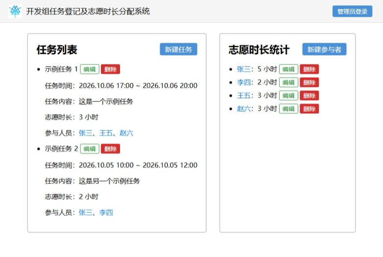
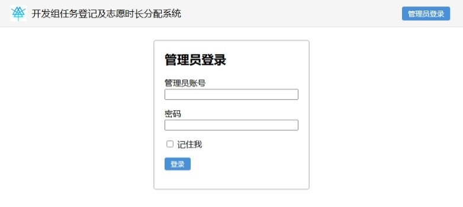
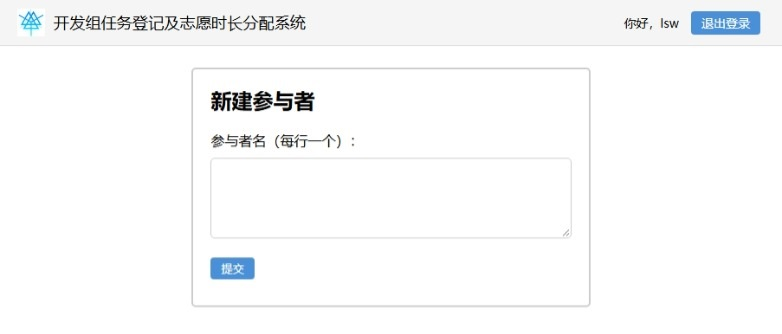
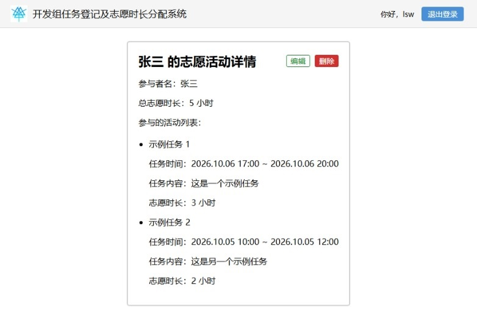
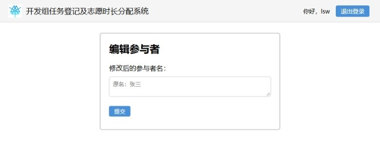
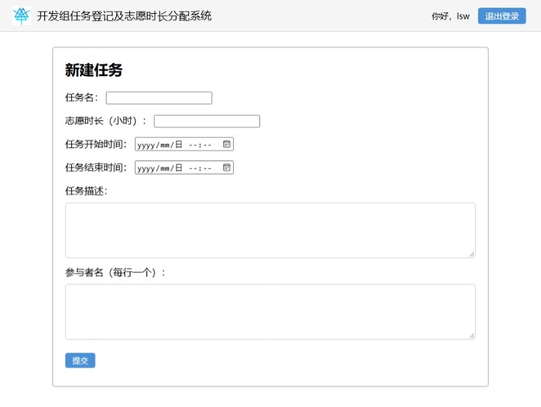
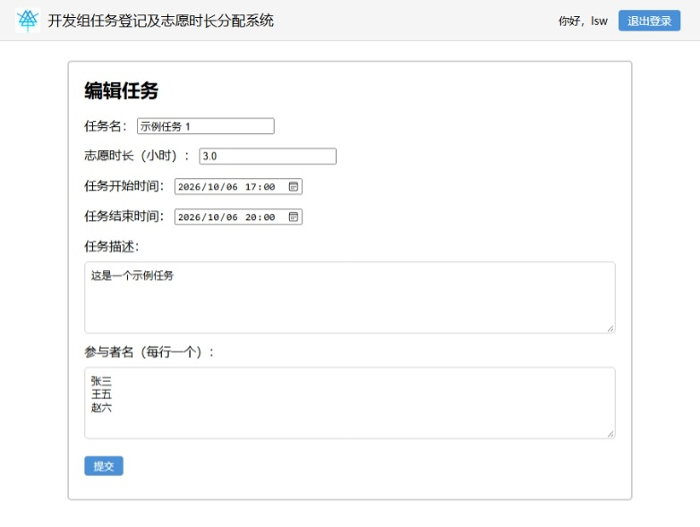

# volunteer-hours-system

开发组任务登记及志愿时长分配系统——一个用于登记开发组内部任务、自动统计并分配成员志愿时长的 Web 系统。

## 功能特性

- 任务管理（登记 / 查看 / 编辑 / 删除）
- 参与者管理（登记 / 查看 / 编辑 / 删除）
- 时长统计（首页自动汇总 + 参与者页面明细查询）
- 响应式界面（桌面 / 移动端）
- 账号登录与权限管理

## 技术栈

- **前端**：原生 HTML + CSS + JavaScript
- **后端**：Python 3.x：Flask + Flask-SQLAlchemy + SQLite
- **迁移**：Flask-Migrate（Alembic）
- **生产**：gunicorn

## 项目结构

```
volunteer-hours-system/
│
├── app/                                  # 应用包（核心代码）
│   ├── __init__.py                       # 应用工厂
│   ├── extensions.py                     # 扩展实例
│   ├── models.py                         # 所有数据模型
│   ├── routes.py                         # main 蓝图：所有业务路由
│   ├── validate.py                       # 输入校验
│   ├── auth/                             # 认证蓝图（管理员登录）
│   │   ├── __init__.py                   # auth_bp = Blueprint("auth", __name__)
│   │   ├── forms.py                      # LoginForm（FlaskForm）
│   │   └── routes.py                     # /login /logout
│   ├── utils/                            # 工具模块
│   │   └── decorators.py                 # admin_required 装饰器
│   ├── templates/                        # Jinja2 模板
│   └── static/                           # 静态资源（JS / CSS / favicon）
├── docs/                                 # 文档
│   └── images/                           # 图片
├── migrations/                           # Alembic 迁移目录
│   └── versions/                         # 迁移脚本
├── instance/                             # 运行时数据
├── app.py                                # 开发入口
├── config.py                             # 配置类
├── entrypoint.py                         # 生产部署入口
└── requirements.txt                      # 依赖清单
```

## 本地运行

### 环境变量

- `FLASK_APP`：运行 `flask` 子命令时需要（**必填**）。

配置方法（Windows PowerShell）：

```bash
$env:FLASK_APP = "app.py"
```

配置方法（Linux Bash）：

```bash
export FLASK_APP="app.py"
```

### 运行方法

```bash
git clone https://github.com/WhiteCatBlackHat/volunteer-hours-system
cd volunteer-hours-system
pip install -r requirements.txt
flask db upgrade
flask create-admin  # 首次使用前需创建管理员账号
python app.py
```

## 服务器部署

### 环境变量

- `FLASK_APP`：运行 `flask` 子命令时需要（**必填**）；
- `SECRET_KEY`：Flask 会话密钥（**必填**）；
- `PORT`：监听端口（可选，默认 `5000`）。

配置方法（Windows PowerShell）：

```bash
$env:FLASK_APP = "app.py"
$env:SECRET_KEY = "your_secret_key"
$env:PORT = "5000"
```

配置方法（Linux Bash）：

```bash
export FLASK_APP="app.py"
export SECRET_KEY="your_secret_key"
export PORT="5000"
```

### 运行方法

```bash
git clone https://github.com/WhiteCatBlackHat/volunteer-hours-system
cd volunteer-hours-system
pip install -r requirements.txt
flask create-admin      # 首次使用前需创建管理员账号
python entrypoint.py    # entrypoint.py 已包含 flask db upgrade
```

## 管理员创建

确保环境变量设置正确后，运行以下命令并根据提示进行操作：

```bash
flask create-admin
```

运行以下命令并根据提示操作以封禁管理员：

```bash
flask ban
```

## API 接口

| 方法 | 路径 | 说明 |
|---|---|---|
| GET | `/` | 首页 |
| GET, POST | `/auth/login` | 登录 |
| GET | `/auth/logout` | 登出 |
| GET | `/task/list` | 任务列表 |
| GET | `/task/new` | 新建任务页面 |
| POST | `/task/add` | 新建任务 |
| GET | `/task/edit/<id>` | 编辑任务页面 |
| PUT | `/task/edit/<id>` | 编辑任务 |
| DELETE | `/task/delete/<id>` | 删除任务 |
| GET | `/user/list` | 参与者列表 |
| GET | `/user/<username>` | 参与者页面 |
| GET | `/user/new` | 新建参与者页面 |
| POST | `/user/add` | 新建参与者 |
| GET | `/user/edit/<username>` | 编辑参与者页面 |
| PUT | `/user/edit/<username>` | 编辑参与者 |
| DELETE | `/user/delete/<username>` | 删除参与者 |
| GET | `/user/<username>/total_hours` | 累计时长 |

## 使用说明

### 登录系统

在本地运行或在服务器上部署后，访问相应的网站地址，使用管理员账号登录：

- 首次使用需运行 `flask create-admin` 创建管理员账号；
- 右上角会显示当前登录的管理员名称；
- 点击"退出登录"按钮退出。





### 参与者管理

#### 添加参与者

1. 点击首页"新增参与者"按钮；
2. 填写参与者姓名并提交表单。



#### 查看个人时长

点击参与者姓名进入个人页面，可见该成员完成的所有任务和累计时长。



#### 编辑 / 删除参与者

首页志愿时长统计与参与者页面中每个参与者名称右侧有"编辑"和"删除"按钮，删除前会弹出确认框，避免误删。



### 任务管理

#### 新建任务

1. 点击首页"新建任务"按钮。
2. 填写以下信息：
    - **任务名称**：简短描述任务内容；
    - **任务内容**：详细描述任务内容；
    - **起止时间**：任务的起止时间；
    - **志愿时长**：完成任务可获得的志愿时长（单位：小时）；
    - **参与成员**：每行填写一个参与者（注意：创建任务前需先创建参与任务的成员）。
3. 点击"提交"。



#### 编辑 / 删除任务

首页任务列表中每个任务名称右侧有"编辑"和"删除"按钮，删除前会弹出确认框，避免误删。



### 时长统计

- **首页**：实时汇总所有任务的总时长；
- **参与者页**：每个成员的个人时长明细。

### 常见问题

**Q1: 普通用户可以登录吗？**

A：不可以。系统只对管理员开放，需要用 `flask create-admin` 创建的账号登录，普通用户仅能查看首页与参与者页面，不能进行任务管理。

**Q2: 任务删除后，参与者已获得的时长会被清空吗？**

A：会。请谨慎删除已被认领的任务。

**Q3: 多人完成同一任务，时长怎么算？**

A：每个参与者获得的时长独立计算，互不影响。

**Q4: 任务的志愿时长是否必须等于起止时间之差？**

A：不必须。

## 开发团队

- 前端：@[WhiteCatBlackHat](https://github.com/WhiteCatBlackHat)
- 后端：@[aaa1145141919810](https://github.com/aaa1145141919810)

## License

MIT License